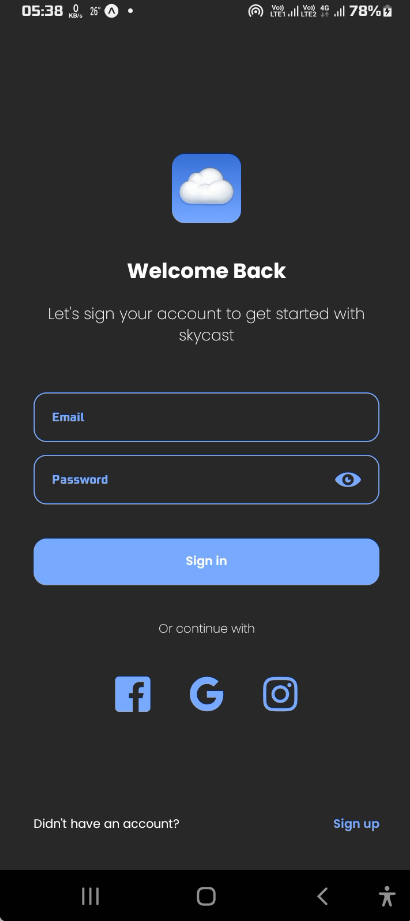
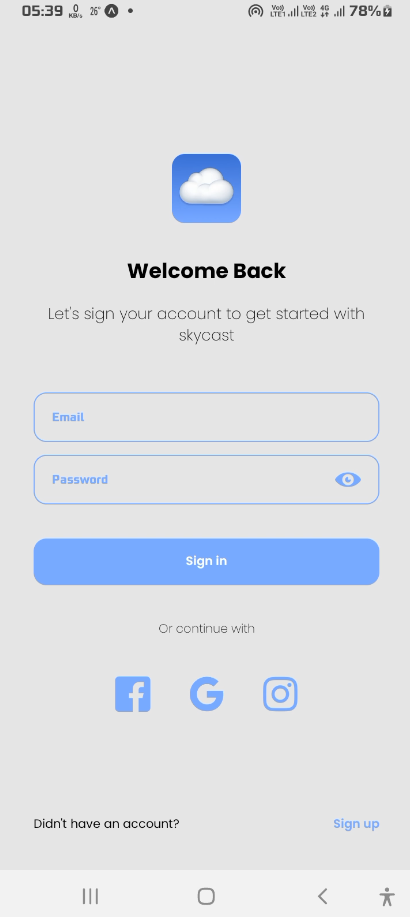
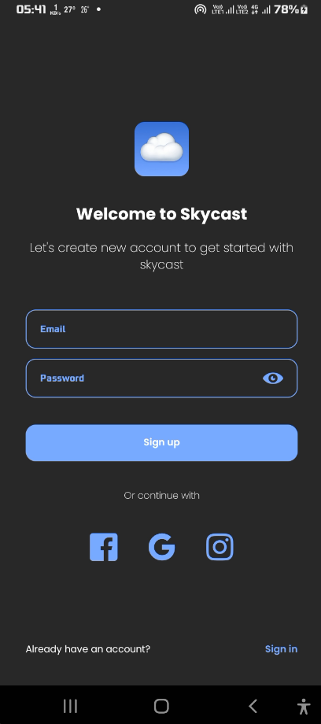
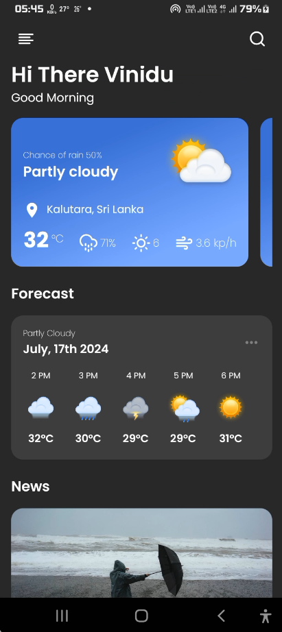

# SkyCast

SkyCast is a powerful and user-friendly weather mobile application designed to provide real-time weather updates and allow users to save their favorite locations for quick access. Built with React Native, NativeWind, and Firebase, SkyCast delivers a seamless and visually appealing experience across both iOS and Android platforms.

## Features

- **Real-Time Weather Data**: Get up-to-date weather information for your current location or any selected city around the world.
- **Favorite Locations**: Save your favorite locations to easily check the weather conditions in multiple places.
- **Customizable Themes**: Choose between light and dark themes to match your preferences.
- **User Authentication**: Secure sign-in and sign-up functionality powered by Firebase.
- **Personalized Dashboard**: Access your saved locations and weather data through a clean and intuitive dashboard.
- **Push Notifications**: Stay informed with weather alerts and notifications.

## Technologies Used

- **React Native**: For building the cross-platform mobile application.
- **NativeWind**: For styling the app with Tailwind CSS in React Native.
- **Firebase**: For authentication, database, and cloud functionalities.
- **Expo**: For a streamlined development process and easy deployment across platforms.
- **Axios**: For making HTTP requests to fetch weather data from APIs.

## Screenshots

### Splash screen

### Sign in screen

  
  

### Sign up screen

  
  

### Drawer

### Dashboard

  
  

## License

This project is licensed under the MIT License - see the LICENSE file for details.

